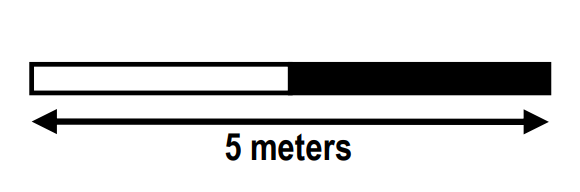
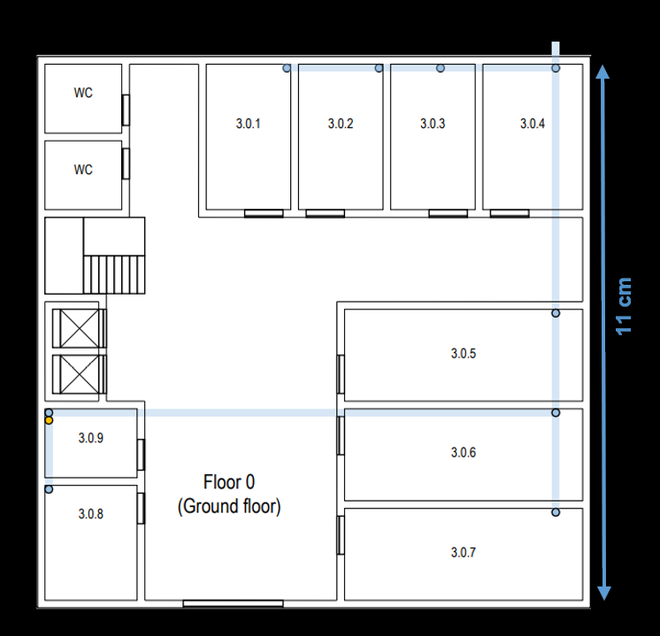
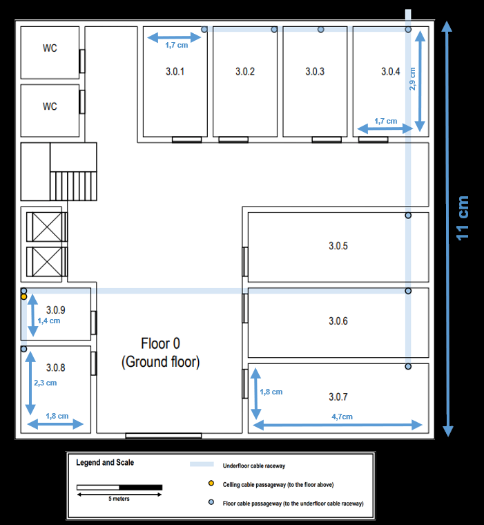
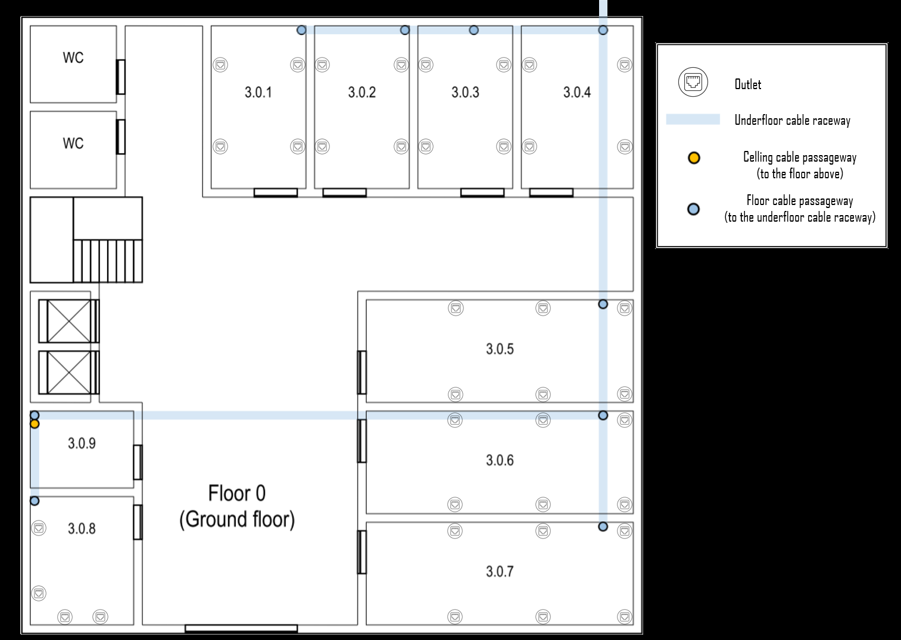
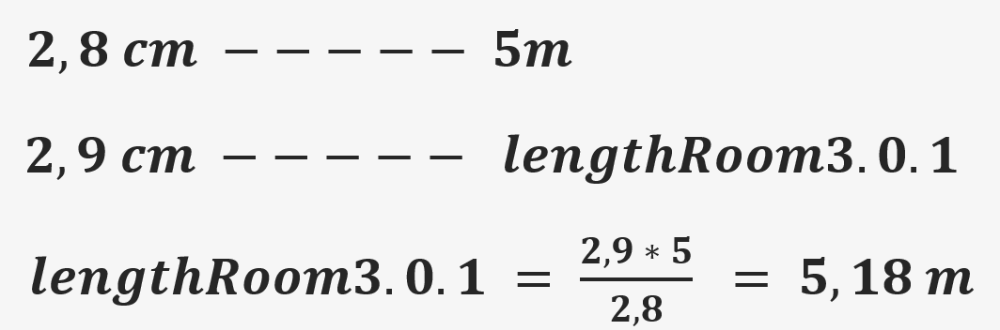
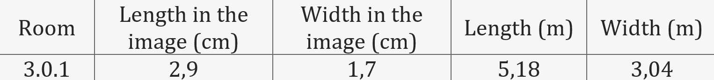
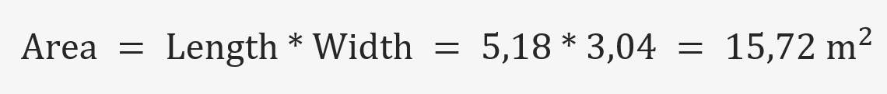
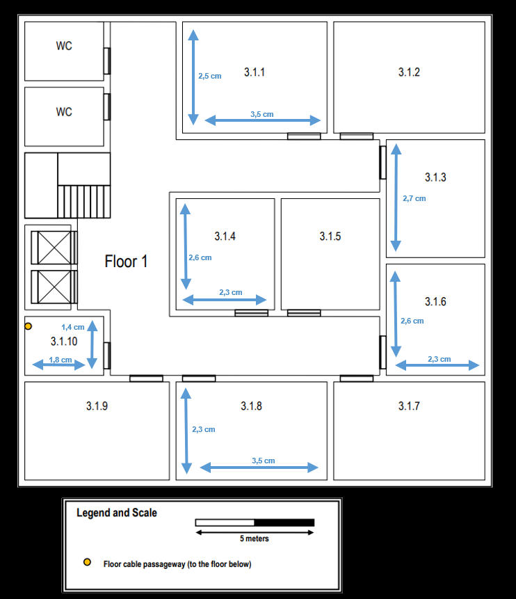
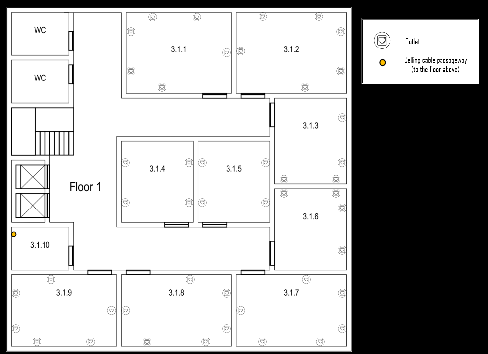
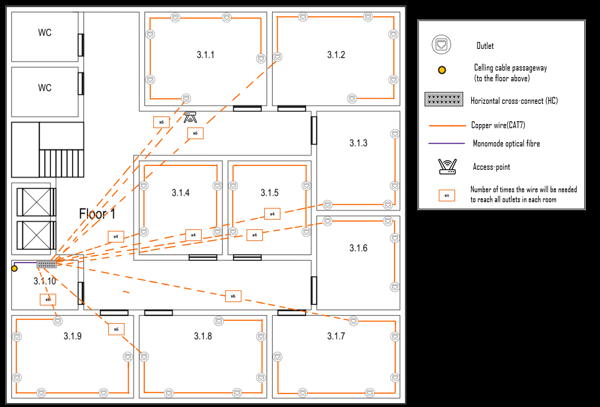

RCOMP 2021-2022 Project - Sprint 1 - Member 1200720 Folder
===========================================

## Identification of the structured cabling standards used

- Minimum of 2 outlets per work area.
- Proportion of 2 outlets for every 10 square meters of area.
- Patch cords can reach up to 5 meters.
- There must always be an outlet less than 3 meters from the user's equipment.
- Work areas require copper cable outlets.
- Each cable (whatever type) length should be less than 90 meters.
- The total area covered by a horizontal cross-connect should be less than 1000 m2.
- Straight line distance between the horizontal cross-connect and the outlet should be less than 80 meters.
- Cables connecting an intermediate cross-connect (IC) to a horizontal cross-connect (HC) are limited to 500 meters in length.
- Cables connecting the main cross-connect (MC) to an IC are limited to 1500 meters in length.
- The number of cables entering a telecommunications cabinet must always be less than 200.

## Building 3

### Scale measure:

- 2,8 cm (scale) = 5m (reality)

### Building measurement:

- As the building has the shape of a square, it was only necessary to measure one of its sides and convert this measurement to the real scale.

| Build | Length (m) | Width(m) | Area(m2) | 
|-------|------------|----------|----------|
| 3     | 19,64      | 19,64    | 385,84   |

## Building 3 - Floor 0 

### Calculated information:
| Room    | Length (m) | Width (m) | Area (m2) | Number of outlets |
|---------|------------|-----------|-----------|-------------------|
| 3.0.1   | 5,18       | 3,04      | 15,72     | 4                 |
| 3.0.2   | 5,18       | 3,04      | 15,72     | 4                 |
| 3.0.3   | 5,18       | 3,04      | 15,72     | 4                 |
| 3.0.4   | 5,18       | 3,57      | 18,49     | 4                 |
| 3.0.5   | 8,39       | 3,21      | 26,98     | 6                 |
| 3.0.6   | 8,39       | 3,21      | 26,98     | 6                 |
| 3.0.7   | 8,39       | 3,21      | 26,98     | 6                 |
| 3.0.8   | 4,11       | 3,21      | 13,20     | 4                 |
| 3.O.9   | 3,21       | 2,50      | 8,04      | -                 |

### Outlet positioning:

* As rooms 3.0.5, 3.0.6 and 3.0.7 have a length of 8.39 meters, we had to be careful to comply with the structured cabling standard, which tells us that a user must always have an outlet available. less than 3 meters. To achieve this objective, the reasoning methodology used was to divide the length of the wall into three equal parts, thus ensuring that there will always be an outlet less than three meters away.

* For the other rooms, the same reasoning was implemented: distributing the outlets along the midpoints of the walls, so that we could achieve a balanced distribution.

### Relevant Justifications:

* The ceiling height on this floor is 4 meters.

* Room 3.0.9 is a storage area that may be used to house a cross-connect, no network outlets are required there, and the same applies to restrooms and the entrance hall.

* Example of how the size of the rooms in the image was converted to their actual size.
  

* After having done the process of converting the size of the rooms in the image to their real size, it was necessary to calculate the area of each room. As the rooms are rectangular, it was only necessary to multiply their length by the width after converting the units. Below we will show an example of how the calculations were made.
  
  

### Total Inventory Floor 0:

| Equipment | Quantity |
|-----------|----------|
| Outlets   | 38       |

## Building 3 - 1st Floor

###  Calculated information:
| Room   | Length (m) | Width (m)	 | Area (m2)  | Number of outlets |
|--------|------------|------------|------------|-------------------|
| 3.1.1  | 6,25       | 4,46       | 27,90      | 6                 |
| 3.1.2  | 6,25       | 4,46       | 27,90      | 6                 |
| 3.1.3  | 4,82       | 4,11       | 19,80      | 4                 |
| 3.1.4  | 4,64       | 4,11       | 19,07      | 4                 |
| 3.1.5  | 4,64       | 4,11       | 19,07      | 4                 |
| 3.1.6  | 4,64       | 4,11       | 19,07      | 4                 |
| 3.1.7  | 6,25       | 4,46       | 25,67      | 6                 |
| 3.1.8  | 6,25       | 4,46       | 25,67      | 6                 |
| 3.1.9  | 6,25       | 4,46       | 25,67      | 6                 |
| 3.1.10 | 3,21       | 2,50       | 8,04       | -                 |

### Outlet positioning:

* As rooms 3.1.7, 3.1.8 and 3.1.9 have a length of 6.25 meters, we had to be careful to comply with the structured cabling standard, which tells us that a user must always have an outlet available. less than 3 meters. To achieve this objective, the reasoning methodology used was to divide the length of the wall into three equal parts, thus ensuring that there will always be an outlet less than three meters away.

* For the other rooms, the same reasoning was implemented: distributing the outlets along the midpoints of the walls, so that we could achieve a balanced distribution.

### Cable path layout:

* **As we will assign numbers to the outlets to better organize the measurement process, we will consider that outlet number 1 will always receive the cable from the HC and the others will be numbered incrementally, always clockwise.**

#### Measurement of cables needed for the room 3.1.1:
| Outlet | Amount of cable needed to get from the HC to the outlet (m) |
|--------|-------------------------------------------------------------|
| 1      | 19,11                                                       |
| 2      | 22,86                                                       |
| 3      | 24,46                                                       |
| 4      | 27,68                                                       |
| 5      | 29,64                                                       |
| 6      | 33,48                                                       |

#### Measurement of cables needed for the room 3.1.2:
| Outlet | Amount of cable needed to get from the HC to the outlet (m) |
|--------|-------------------------------------------------------------|
| 1      | 23,75                                                       |
| 2      | 26,96                                                       |
| 3      | 29,11                                                       |
| 4      | 31,61                                                       |
| 5      | 33,21                                                       |
| 6      | 36,61                                                       |

#### Measurement of cables needed for the room 3.1.3:
| Outlet | Amount of cable needed to get from the Hc to the outlet (m) |
|--------|-------------------------------------------------------------|
| 1      | 23,21                                                       |
| 2      | 25,18                                                       |
| 3      | 27,59                                                       |
| 4      | 29,91                                                       |

#### Measurement of cables needed for the room 3.1.4:
| Outlet | Amount of cable needed to get from the Hc to the outlet (m) |
|--------|-------------------------------------------------------------|
| 1      | 14,82                                                       |
| 2      | 17,14                                                       |
| 3      | 25,89                                                       |
| 4      | 23,57                                                       |

#### Measurement of cables needed for the room 3.1.5:
| Outlet | Amount of cable needed to get from the Hc to the outlet (m) |
|--------|-------------------------------------------------------------|
| 1      | 17,86                                                       |
| 2      | 19,82                                                       |
| 3      | 21,96                                                       |
| 4      | 24,29                                                       |

#### Measurement of cables needed for the room 3.1.6:
| Outlet | Amount of cable needed to get from the Hc to the outlet (m) |
|--------|-------------------------------------------------------------|
| 1      | 23,39                                                       |
| 2      | 25,36                                                       |
| 3      | 27,50                                                       |
| 4      | 29,82                                                       |

#### Measurement of cables needed for the room 3.1.7:
| Outlet | Amount of cable needed to get from the HC to the outlet (m) |
|--------|-------------------------------------------------------------|
| 1      | 24,11                                                       |
| 2      | 27,46                                                       |
| 3      | 29,51                                                       |
| 4      | 32,10                                                       |
| 5      | 35,22                                                       |
| 6      | 38,84                                                       |

#### Measurement of cables needed for the room 3.1.8:
| Outlet | Amount of cable needed to get from the HC to the outlet (m) |
|--------|-------------------------------------------------------------|
| 1      | 15,53                                                       |
| 2      | 19,15                                                       |
| 3      | 22,28                                                       |
| 4      | 24,87                                                       |
| 5      | 26,92                                                       |
| 6      | 30,27                                                       |

#### Measurement of cables needed for the room 3.1.9:
| Outlet | Amount of cable needed to get from the HC to the outlet (m) |
|--------|-------------------------------------------------------------|
| 1      | 11,61                                                       |
| 2      | 26,16                                                       |
| 3      | 22,54                                                       |
| 4      | 19,42                                                       |
| 5      | 16,83                                                       |
| 6      | 14,78                                                       |

### 1st floor inventory:

### Relevant Justifications:

* The ceiling height on this floor is 3 meters, but there’s a removable dropped ceiling, placed 2.5 meters from the ground, covering this entire floor.

* Room 3.1.10 is a storage area, no network outlets are required there as well, and it may be used to house a cross-connect and other network infrastructure hardware.

* Common areas and restrooms are not required to have network outlets.

### 1st floor total inventory:

| Equipment | Quantity |
|-----------|----------|
| Outlets   | 46       |

### Total Building Inventory

| Equipment | Quantity |
|-----------|----------|
| Outlets   | 84       |
