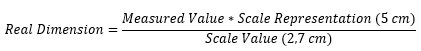
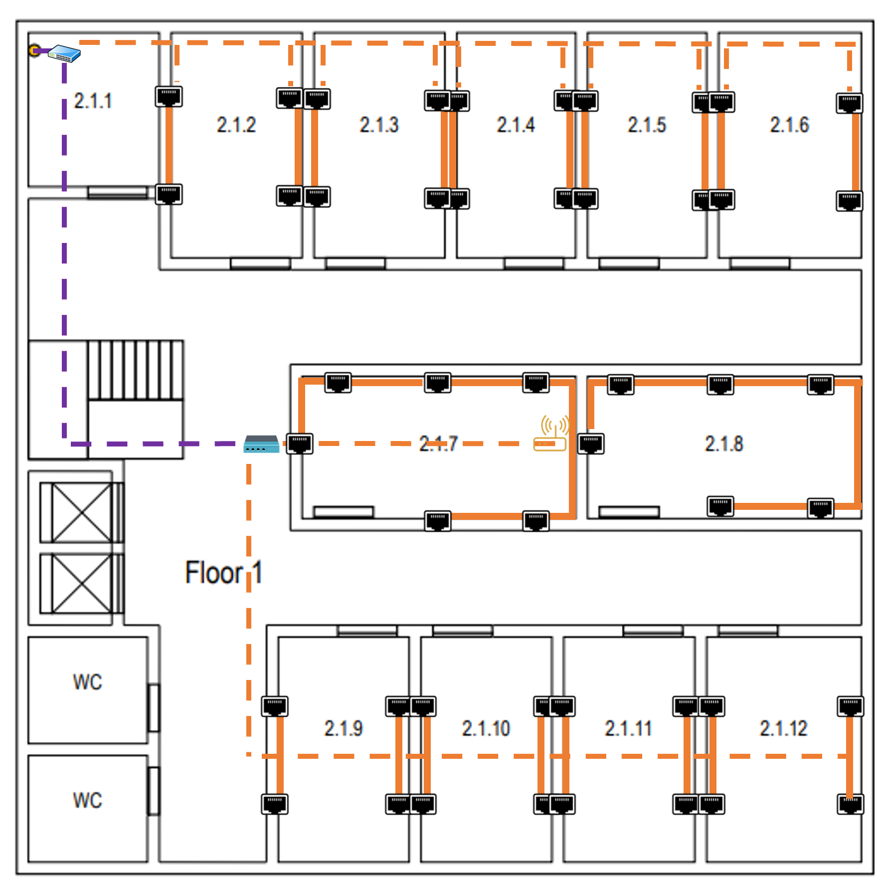

RCOMP 2021-2022 Project - Sprint 1 - Member 1201239 folder
===========================================

## These were the followed structured cabling standards:
- Minimum of 2 outlets per work area.
- Ratio of 2 outlets for every 10 square meters of area.

### Important Remarks:

- So that the plants dimensions could be measured, the provided scale was used. Its real length of 5m
is equivalent to 2.7cm on an A4 printed sheet.

- Once the measurements were performed, the obtained measures 
were converted using the following formula:

- Each room and both floors are considered geometric rectangles. So, it's possible to obtain an area
by just multiplying a division's length by its width.

# Building 2 

## Ground Floor:

> The floor itself is square, with a side of **19,07 m (10,3 cm)**, thus having an area of **363,67 m2**.

### Individual Rooms' Dimensions:

| Room  | Length (m) | Width (m) | Area (m2) | Number of outlets |
|-------|------------|-----------|-----------|-------------------|
| 2.0.1 | 2,96       | 3,51      | 10,39     | 0 (Storage Unit)  |
| 2.0.2 | 5,74       | 5,37      | 30,82     | 8                 |
| 2.0.3 | 9,91       | 8,52      | 84,43     | 18                |
| 2.0.4 | 8,52       | 3,33      | 28,37     | 6                 |
| 2.0.5 | 8,52       | 3,33      | 28,37     | 6                 |
| 2.0.6 | 8,52       | 3,33      | 28,37     | 6                 |

## Ground Floor with outlets:

### Floor inventory:

| Equipment  | Quantity |
|------------|----------|
| Outlets    | -        |
| Switches   | -        |
| Hubs       | -        |
| RJ45 Cable | -        |

## Floor Nº1:

> Like the floor beneath, it has a side of **19,07 m (10,3 cm)**, thus having an area of **363,67 m2**.

### Individual Rooms' Dimensions:

| Room   | Length (m) | Width (m) | Area (m2) | Number of outlets |
|--------|------------|-----------|-----------|-------------------|
| 2.1.1  | 2,96       | 3,51      | 10,39     | 0 (Storage Unit)  |
| 2.1.2  | 2,96       | 5,19      | 15,36     | 4                 |
| 2.1.3  | 2,96       | 5,19      | 15,36     | 4                 |
| 2.1.4  | 2,78       | 5,19      | 14,43     | 4                 |
| 2.1.5  | 2,96       | 5,19      | 15,36     | 4                 |
| 2.1.6  | 3,33       | 5,19      | 17,28     | 4                 |
| 2.1.7  | 6,30       | 3,33      | 20,98     | 6                 |
| 2.1.8  | 6,30       | 3,33      | 20,98     | 6                 |
| 2.1.9  | 2,96       | 5,19      | 15,36     | 4                 |
| 2.1.10 | 2,96       | 5,19      | 15,36     | 4                 |
| 2.1.11 | 2,96       | 5,19      | 15,36     | 4                 |
| 2.1.12 | 3,52       | 5,19      | 18,27     | 4                 |

## First Floor with outlets:

### Floor inventory:

| Equipment  | Quantity |
|------------|----------|
| Outlets    | -        |
| Switches   | -        |
| Hubs       | -        |
| RJ45 Cable | -        |

===========================================

## Building Inventory:

- After performing the building planning, this is the total Inventory:

| Equipment  | Quantity |
|------------|----------|
| Outlets    | -        |
| Switches   | -        |
| Hubs       | -        |
| RJ45 Cable | -        |