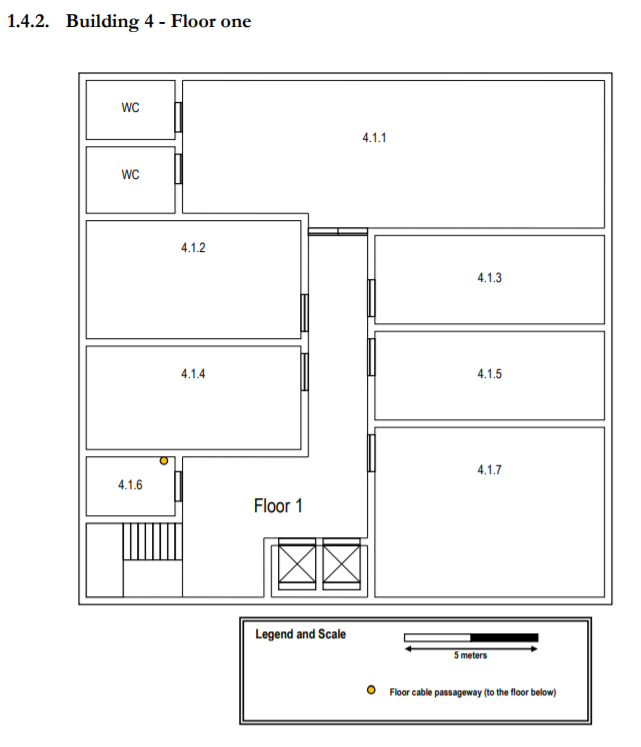
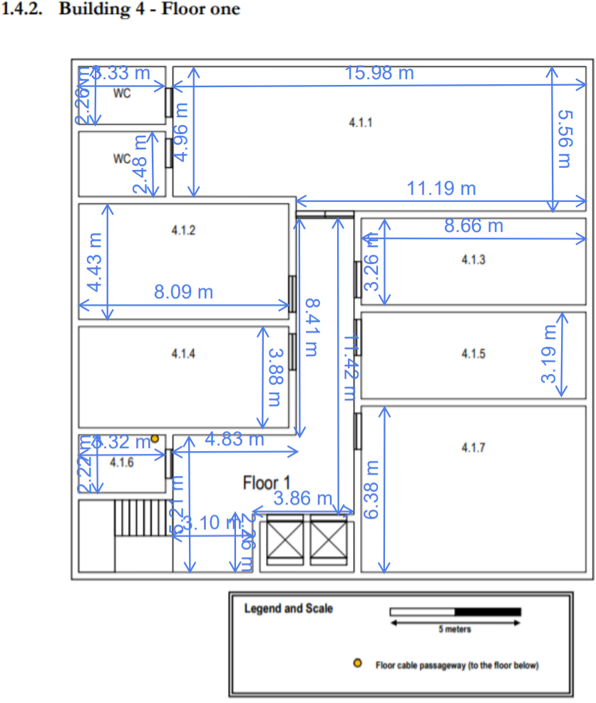

RCOMP 2021-2022 Project - Sprint 1 - Member 1201382 folder
===========================================
(This folder is to be created/edited by the team member 1201382 only)

## These were the followed structured cabling standards:
- Minimum of 2 outlets per work area.
- Ratio of 2 outlets for every 10 square meters of area

## Important remarks

### Scale measure:
- 2,8 cm (scale) = 5m (reality)

# Building 4

## Floor 0 

 
###Observations regarding the design of the Floor 0
* The ground floor has an underfloor cable raceway connected to the external technical ditch. Access to the underfloor cable raceway is available at points marked over the plan. The ceiling height on this floor is 4 meters.
* Room 4.0.5 is a storage area that may be used to house a cross-connect, no network outlets are required there, and the same applies to restrooms and common areas like the entrance hall.

### Individual Rooms' Dimensions:

| Room  | Length (m) | Width (m) | Area (m2) | Number of outlets |
|-------|------------|-----------|-----------|-------------------|
| 4.0.1 | 12,01      | 8,94      | 107,37    | -                 | 
| 4.0.2 | 13,76      | 5,41      | 74,44     | -                 |
| 4.0.3 | 13,76      | 5,31      | 73,07     | -                 |
| 4.0.4 | 13,76      | 10,13     | 139,39    | -                 |
| 4.0.5 | 5,34       | 3,53      | 18,85     | 0 (Storage Unit)  |
| 4.0.6 | 5,34       | 6,64      | 35,46     | -                 |
| 4.0.7 | 5,34       | 6,25      | 33,38     | -                 |

## Floor 1

###Observations regarding the design of the Floor 1
* The ceiling height on this floor is 3 meters, but there’s a removable dropped ceiling, placed 2.5 meters from the ground, and covering this entire floor. 
* The space over the dropped ceiling is perfect to install cable raceways and wireless access-points.
* Common areas are not required to have network outlets, room 4.1.6 is a storage area, no network outlets are required there as well, and it may be used to house a cross-connect and other network infrastructure hardware. Other identified rooms must be provided with the standard number of network outlets.

### Floor 1 measures

| Room  | Length (m) | Width (m) | Area (m2) | Number of outlets |
|-------|------------|-----------|-----------|-------------------|
| 4.1.1 | 23,67      | 7,47      | 176,81    | -                 | 
| 4.1.1 | 16,62      | 0,75      | 12,47     | -                 | 
| 4.1.1 | 23,67 + 16,62 | 7,47 + 0,75 | 189,28 | -                 | 
| 4.1.2 | 12,06      | 6,55      | 78,99     | -                 |
| 4.1.3 | 12,8       | 4,95      | 63,36     | -                 |
| 4.1.4 | 12,06      | 5,8       | 69,95     | -                 |
| 4.1.5 | 12,8       | 4,95      | 63,36     | -                 |
| 4.1.6 | 5,00       | 3,36      | 16,8      | 0 (Storage Unit)  |
| 4.1.7 | 12,8       | 9,57      | 122,50    | -                 |

In order to calculate the area of division 4.1.1, the division was divided into 2 parts - yellow and blue