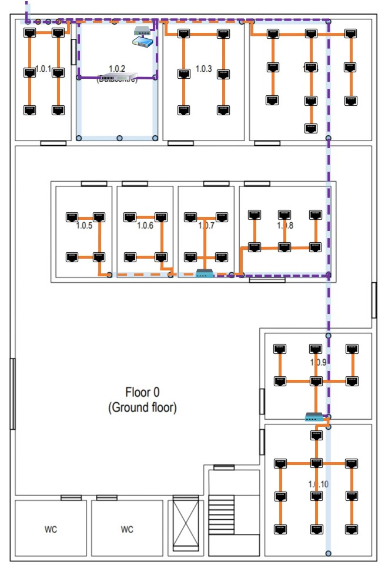
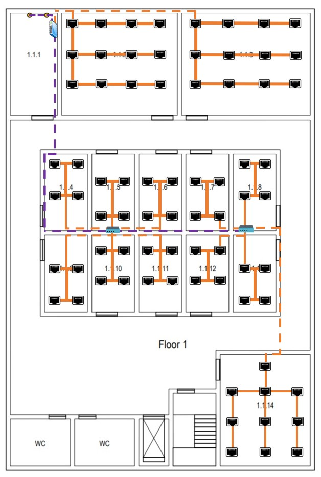

RCOMP 2021-2022 Project - Sprint 1 - Member 1201386 Folder
===========================================

## Edifício 1

### Medida do edifício:
- 30m × 20m = 600 metros quadrados

## Edifico 1 - Piso 0

### Medida da escala:

- 5m (real) = 2,7cm (escala)

### Informações Calculadas: 
| Room  |	Comprimento (m) |	Largura (m)	 | Área (m2)  |Quantidade de outlets |
|-------|-------------------|----------------|------------|----------------------|
|1.0.1  |6,6667          	|3,0556     	 |20,3708	  |	6	            	 |
|1.0.2  |6,6667          	|4,4444     	 |29,6295	  |	0	           	     |
|1.0.3  |6,6667          	|4,4444     	 |29,6295	  |	6	            	 |
|1.0.4  |6,6667          	|6,6667     	 |44,4449	  |	10	            	 |
|1.0.5  |5              	|3,0556     	 |15,278	  |	4	            	 |
|1.0.6  |5               	|3,0556     	 |15,278	  |	4	            	 |
|1.0.7  |5               	|3,0556     	 |15,278	  |	4	            	 |
|1.0.8  |5               	|5          	 |25    	  |	6	            	 |
|1.0.9  |4,6296          	|5,9259     	 |27,4345	  |	6	            	 |
|1.0.10 |7,2222          	|5,9259     	 |42,798	  |	10	            	 |

### Plano da Cablagem Estruturada:

### Justificações Relevantes:
  
#### Outlets

- As áreas comuns, como o átrio de entrada, as casas de banho e as escadas, não
  necessitam de outlets.
  
- A distribuição dos outlets foi realizada tendo em consideração os melhores locais
  para que o room em questão não fosse muito afetado, para que não ficassem próximas de portas
  e para que seja possível com maior facilidade aproveitar o meio da sala para trabalhar.

- No posicionamento dos outlets foi também pensado de modo que entre os mesmos, a distância máxima seja
  de três metros, para que em qualquer parte da sala onde o equipamento do utilizador se encontre
  consiga com o patch cord que é fornecido ter acesso a uma tomada de rede.
  
- A quantidade de outlets por room foi obtida utilizando a proporção de 2 outlets para cada 
  10 metros quadrados de área.

####  Consolidation Points

- Ao todo neste piso temos 2 Consolidation Points. 
  Um na sala 1.0.7, que é responsável por controlar as salas 1.0.5, 1.0.6, 1.0.7 e 1.0.8, ficando responsável por 18 outlets.
  O outro encontra-se na sala 1.0.9, que é responsável por controlar as salas 1.0.9 e 1.0.10, ficando responsável por 16 outlets.
  
- A ligação do HC com os CP's é feita através do underfloor cable raceway.

####  Horizontal cross-connect

- Este piso apresenta apenas um HC, pois este tem uma cobertura de cerca de 1000 metros
  quadrados e o edifício apresenta apenas 600 metros quadrados de área.
  
- O datacentre do edifício e do campus está localizado na sala 1.0.2 portanto o Horizontal cross-connect
  foi colocado nesta sala localizado no mesmo armário técnico que o Intermediate cross-connect.
  
####  Intermediate cross-connect

- O datacentre do edifício e do campus está localizado na sala 1.0.2 portanto o Intermediate cross-connect
  foi colocado nesta sala localizado no mesmo armário técnico que o Horizontal cross-connect.
  
- O IC recebe fibra ótica do MC e passa a fibra ótica para os dois HC's deste edifício.

####  Main cross-connect

- O datacentre do edifício e do campus está localizado na sala 1.0.2 portanto o main cross-connect
  foi colocado nesta sala. 
  
- O Main cross-connect é responsável por distribuir para o Intermediate cross-connect deste edifício e dos outros
  a fibra ótica monomodo através da passagem para o exterior, por este motivo do MC sai 1 cabo de fibra ótica monomodo
  que se conecta ao IC deste edifício.
  
#### Cabos Utilizados e Respetivas Quantidades

##### Sala 1.0.1

| Outlet | Quantidade de cabo CAT 7 necessário desde o CP até ao outlet (m)|
|--------|-----------------------------------------------------------------|
| 1      | 3,91                                                            |
| 2      | 6,13                                                            |
| 3      | 6,13                                                            |
| 4      | 5,95                                                            |
| 5      | 8,17                                                            |
| 6      | 8,17                                                            |

##### Sala 1.0.3

| Outlet | Quantidade de cabo CAT 7 necessário desde o CP até ao outlet (m)|
|--------|-----------------------------------------------------------------|
| 1      | 3,91                                                            |
| 2      | 6,13                                                            |
| 3      | 6,13                                                            |
| 4      | 5,95                                                            |
| 5      | 8,17                                                            |
| 6      | 8,17                                                            | |

##### Sala 1.0.4

| Outlet | Quantidade de cabo CAT 7 necessário desde o CP até ao outlet (m)|
|--------|-----------------------------------------------------------------|
| 1      | 3,91                                                            |
| 2      | 6,13                                                            |
| 3      | 6,13                                                            |
| 4      | 5,95                                                            |
| 5      | 8,17                                                            |
| 6      | 8,17                                                            |
| 7      | 6,13                                                            |
| 8      | 5,95                                                            |
| 9      | 8,17                                                            |
| 10     | 8,17                                                            |

##### Sala 1.0.5

| Outlet | Quantidade de cabo CAT 7 necessário desde o CP até ao outlet (m)|
|--------|-----------------------------------------------------------------|
| 1      | 11,88                                                           |
| 2      | 14,2                                                            |
| 3      | 14,1                                                            |
| 4      | 16,42                                                           |

Obtendo-se um total de 56,6 m de cabo CAT 7.

##### Sala 1.0.6

| Outlet | Quantidade de cabo CAT 7 necessário desde o CP até ao outlet (m)|
|--------|-----------------------------------------------------------------|
| 1      | 8,72                                                            |
| 2      | 11,04                                                           |
| 3      | 10,94                                                           |
| 4      | 13,26                                                           |

Obtendo-se um total de 43,96 m de cabo CAT 7.

##### Sala 1.0.7

| Outlet | Quantidade de cabo CAT 7 necessário desde o CP até ao outlet (m)|
|--------|-----------------------------------------------------------------|
| 1      | 3,96                                                            |
| 2      | 3,96                                                            |
| 3      | 6,18                                                            |
| 4      | 6,18                                                            |

Obtendo-se um total de 20,28 m de cabo CAT 7.

##### Sala 1.0.8

| Outlet | Quantidade de cabo CAT 7 necessário desde o CP até ao outlet (m)|
|--------|-----------------------------------------------------------------|
| 1      | 6,1                                                             |
| 2      | 8,1                                                             |
| 3      | 8,1                                                             |
| 4      | 10,1                                                            |
| 5      | 10,1                                                            |
| 6      | 12,1                                                            |

Obtendo-se um total de 54,6 m de cabo CAT 7.

##### Sala 1.0.9

| Outlet | Quantidade de cabo CAT 7 necessário desde o CP até ao outlet (m)|
|--------|-----------------------------------------------------------------|
| 1      | 3,91                                                            |
| 2      | 6,13                                                            |
| 3      | 6,13                                                            |
| 4      | 5,95                                                            |
| 5      | 8,17                                                            |
| 6      | 8,17                                                            |

Obtendo-se um total de 38,46 m de cabo CAT 7.

##### Sala 1.0.10

| Outlet | Quantidade de cabo CAT 7 necessário desde o CP até ao outlet (m)|
|--------|-----------------------------------------------------------------|
| 1      | 3,55                                                            |
| 2      | 5,77                                                            |
| 3      | 7,99                                                            |
| 4      | 7,99                                                            |
| 5      | 7,99                                                            |
| 6      | 10,21                                                           |
| 7      | 10,21                                                            |
| 8      | 10,21                                                            |
| 9      | 12,43                                                            |
| 10     | 12,43                                                            |

Obtendo-se um total de 88,78 m de cabo CAT 7.

#### Gabinetes de Telecomunicações 

##### Sala 1.0.2

- Visto esta ter associado 22 outlets, existirão 22 ligações logo será necessário um patch panel
  CAT7 de 24 portas, tendo este o tamanho de 1U.

- Visto que HC conecta-se ao IC e a 2 CP's precisará de um Fiber Patch Panel, tendo este o tamanho de 1U. 
  Como o IC conecta-se ao HC e ao MC através de cabo de fibra ótica será necessário mais um Fiber Patch Panel, 
  tendo este o tamanho de 1U.

- O espaço guardado para os equipamentos ativos terá um tamanho de.

- Irá ser adicionado, para além do valor já calculado, um tamanho extra de.

- Posto isto, o tamanho total para este gabinete de telecomunicações será de.

Nesta sala existe outro gabinete de telecomunicações que será onde o MC ficará instalado.

- Será necessário um Fiber Patch Panel, tendo este o tamanho de 1U.

- O espaço guardado para os equipamentos ativos terá um tamanho de.

- Irá ser adicionado, para além do valor já calculado, um tamanho extra de.

- Posto isto, o tamanho total para este gabinete de telecomunicações será de.

##### Sala 1.0.7

- Visto esta ter associado 18 outlets, existirão 18 ligações logo será necessário um patch panel
  CAT7 de 24 portas, tendo este o tamanho de 1U.

- Como optei que a ligação entre o HC e o CP fosse realizada com cabo de fibra ótica monomodo também será
  necessário 1 fibre patch panel, tendo este o tamanho de 1U.

- O espaço guardado para os equipamentos ativos terá um tamanho de.

- Irá ser adicionado, para além do valor já calculado, um tamanho extra de.

- Posto isto, o tamanho total para este gabinete de telecomunicações será de.

##### Sala 1.0.9

- Visto esta ter associado 16 outlets, existirão 16 ligações logo será necessário um patch panel 
  CAT7 de 24 portas, tendo este o tamanho de 1U.
  
- Como optei que a ligação entre o HC e o CP fosse realizada com cabo de fibra ótica monomodo também será 
  necessário 1 fibre patch panel, tendo este o tamanho de 1U.
  
- O espaço guardado para os equipamentos ativos terá um tamanho de.

- Irá ser adicionado, para além do valor já calculado, um tamanho extra de.

- Posto isto, o tamanho total para este gabinete de telecomunicações será de.

### Inventário Total Piso 0:

| Equipamento       |	Quantidade |
|-------------------|--------------|
|Access Point 		|	1		   |
|Outlets	        |	56		   |

## Edifico 1 - Piso 1

### Medida da escala:

- 5m (real) = 2,7cm (escala)

### Informações Calculadas:
| Room  |	Comprimento (m) |	Largura (m)	 | Área (m2)  |Quantidade de outlets |
|-------|-------------------|----------------|------------|----------------------|
|1.1.1  |6,6667          	|3,0556     	 |20,3708	  |	0	            	 |
|1.1.2  |6,6667          	|7,5926     	 |50,6176	  |	12	            	 |
|1.1.3  |6,6667          	|8,5185     	 |56,7903	  |	12	            	 |
|1.1.4  |5               	|2,7778     	 |13,889	  |	4	            	 |
|1.1.5  |5               	|2,7778     	 |13,889	  |	4	            	 |
|1.1.6  |5               	|2,7778     	 |13,889	  |	4	            	 |
|1.1.7  |5               	|2,7778     	 |13,889	  |	4	            	 |
|1.1.8  |5               	|2,7778     	 |13,889	  |	4	            	 |
|1.1.9  |5               	|2,7778     	 |13,889	  |	4	            	 |
|1.1.10 |5               	|2,7778     	 |13,889	  |	4	            	 |
|1.1.11 |5               	|2,7778     	 |13,889	  |	4	            	 |
|1.1.12 |5               	|2,7778     	 |13,889	  |	4	            	 |
|1.1.13 |5               	|2,7778     	 |13,889	  |	4	            	 |
|1.1.14 |7,2222          	|5,9259     	 |42,798	  |	10	            	 |

### Plano da Cablagem Estruturada:

### Justificações Relevantes:

- A sala 1.1.1 é uma área de armazenamento e não são necessárias tomadas de rede lá,
  e o mesmo aplica-se às casas de banho e a áreas comuns como corredores e átrios.

- Do piso anterior, através de uma calha técnica, 2 cabos de fibra ótica emergem 
  provenientes do IC.

#### Consolidation Points

-
  
####  Horizontal cross-connect

- Este piso apresenta apenas um HC, pois este tem uma cobertura de cerca de 1000 metros
  quadrados e o edifício apresenta apenas 600 metros quadrados de área.

- O HC está localizado na sala 1.1.1 num armário técnico, visto o cliente ter dado a indicação que esta sala
  podia ser usada para abrigar uma cross-connect por ser uma área de armazenamento.

- O HC é responsável pelas salas 1.1.2 e 1.1.3.

#### Cabos Utilizados e Respetivas Quantidades

-

#### Gabinetes de Telecomunicações

##### Sala 1.1.1

- Visto esta ter associado 24 outlets, existirão 24 ligações logo será necessário um patch panel
  CAT7 de 24 portas, tendo este o tamanho de 1U.

- Como optei que a ligação entre o HC e o CP fosse realizada com cabo de fibra ótica monomodo e como o HC 
  conecta-se ao IC também com cabo de fibra ótica, será necessário 1 fibre patch panel, tendo este o tamanho de 1U.

- O espaço guardado para os equipamentos ativos terá um tamanho de.

- Irá ser adicionado, para além do valor já calculado, um tamanho extra de.

- Posto isto, o tamanho total para este gabinete de telecomunicações será de.

##### Sala 1.1.5

- Visto esta ter associado 24 outlets, existirão 24 ligações logo será necessário um patch panel
  CAT7 de 24 portas, tendo este o tamanho de 1U.

- Como optei que a ligação entre o HC e o CP fosse realizada com cabo de fibra ótica monomodo também será
  necessário 1 fibre patch panel, tendo este o tamanho de 1U.

- O espaço guardado para os equipamentos ativos terá um tamanho de.

- Irá ser adicionado, para além do valor já calculado, um tamanho extra de.

- Posto isto, o tamanho total para este gabinete de telecomunicações será de.

##### Sala 1.1.8

- Visto esta ter associado 26 outlets, existirão 26 ligações logo será necessário um patch panel
  CAT7 de 48 portas, tendo este o tamanho de 2U.

- Como optei que a ligação entre o HC e o CP fosse realizada com cabo de fibra ótica monomodo também será
  necessário 1 fibre patch panel, tendo este o tamanho de 1U.

- O espaço guardado para os equipamentos ativos terá um tamanho de.

- Irá ser adicionado, para além do valor já calculado, um tamanho extra de.

- Posto isto, o tamanho total para este gabinete de telecomunicações será de.

### Inventário Total Piso 1:

| Equipamento       |	Quantidade |
|-------------------|--------------|
|Access Point 		|	1		   |
|Outlets	        |	74		   |

### Inventário Total Do Edifício 

| Equipamento       |	Quantidade |
|-------------------|--------------|
|Access Point 		|	2		   |
|Outlets	        |	136		   |
