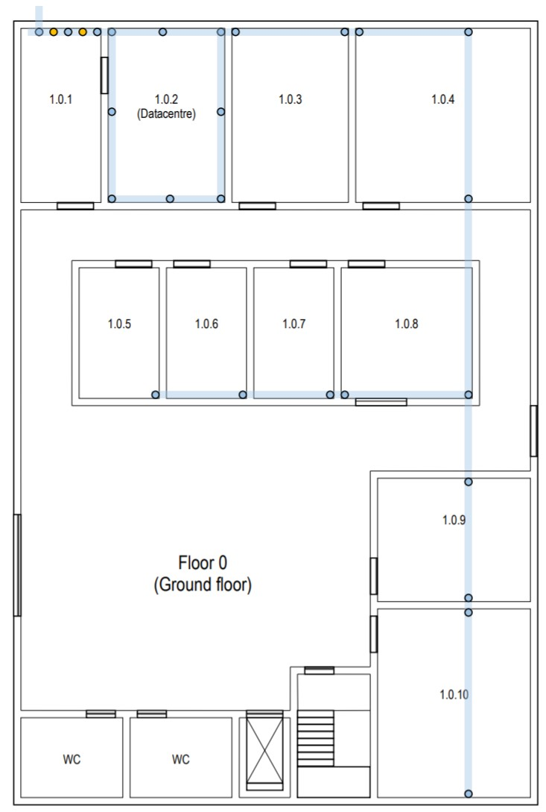
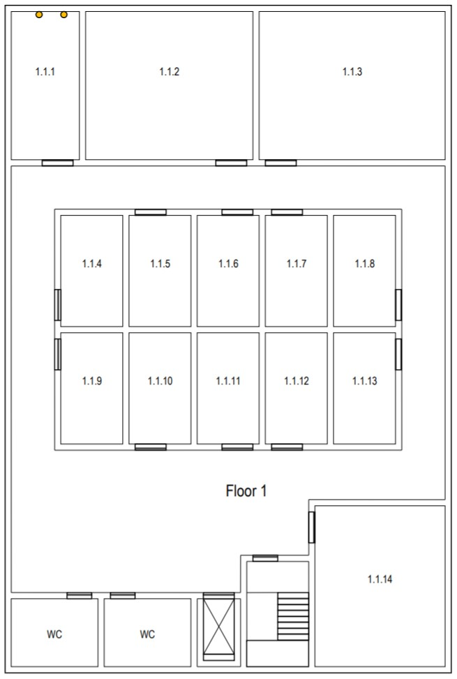

RCOMP 2021-2022 Project - Sprint 1 - Member 1201386 Folder
===========================================

## Identificação das normas de cablagem estruturada utilizadas

### Outlets
- Mínimo de 2 outlets por área de trabalho.
- Proporção de 2 outlets para cada 10 metros quadrados de área.

###  Horizontal cross-connect
- Por cada 1000 metros quadrados de área tem de existir 1 HC.

## Edifício 1

### Medida do edifício:
- 30m x 20m = 600 metros quadrados

## Edifico 1 - Piso 0

### Medida da escala:

- 5m (real) = 2,7cm (escala)

### Informações Calculadas: 
| Room  |	Comprimento (m) |	Largura (m)	 | Área (m2)  |Quantidade de outlets |
|-------|-------------------|----------------|------------|----------------------|
|1.0.1  |6,6667          	|3,0556     	 |20,3708	  |	6	            	 |
|1.0.2  |6,6667          	|4,4444     	 |29,6295	  |	6	           	     |
|1.0.3  |6,6667          	|4,4444     	 |29,6295	  |	6	            	 |
|1.0.4  |6,6667          	|6,6667     	 |44,4449	  |	10	            	 |
|1.0.5  |5              	|3,0556     	 |15,278	  |	4	            	 |
|1.0.6  |5               	|3,0556     	 |15,278	  |	4	            	 |
|1.0.7  |5               	|3,0556     	 |15,278	  |	4	            	 |
|1.0.8  |5               	|5          	 |25    	  |	6	            	 |
|1.0.9  |4,6296          	|5,9259     	 |27,4345	  |	6	            	 |
|1.0.10 |7,2222          	|5,9259     	 |42,798	  |	10	            	 |

### Justificações Relevantes:

- As áreas comuns, como o átrio de entrada, as casas de banho e as escadas, não 
  necessitam de tomadas de rede.
  
- Este piso apresenta apenas um HC, pois este tem uma cobertura de cerca de 1000 metros 
  quadrados e o edifício apresenta apenas 600 metros quadrados de área.

### Disposição dos Outlets:

### Inventário Total Piso 0:

| Equipamento |	Quantidade |
|-------------|------------|
|Outlets	  |	62		   |

## Edifico 1 - Piso 1 

### Medida da escala:

- 5m (real) = 2,7cm (escala)

### Informações Calculadas:
| Room  |	Comprimento (m) |	Largura (m)	 | Área (m2)  |Quantidade de outlets |
|-------|-------------------|----------------|------------|----------------------|
|1.1.1  |6,6667          	|3,0556     	 |20,3708	  |	0	            	 |
|1.1.2  |6,6667          	|7,5926     	 |50,6176	  |	12	            	 |
|1.1.3  |6,6667          	|8,5185     	 |56,7903	  |	12	            	 |
|1.1.4  |5               	|2,7778     	 |13,889	  |	4	            	 |
|1.1.5  |5               	|2,7778     	 |13,889	  |	4	            	 |
|1.1.6  |5               	|2,7778     	 |13,889	  |	4	            	 |
|1.1.7  |5               	|2,7778     	 |13,889	  |	4	            	 |
|1.1.8  |5               	|2,7778     	 |13,889	  |	4	            	 |
|1.1.9  |5               	|2,7778     	 |13,889	  |	4	            	 |
|1.1.10 |5               	|2,7778     	 |13,889	  |	4	            	 |
|1.1.11 |5               	|2,7778     	 |13,889	  |	4	            	 |
|1.1.12 |5               	|2,7778     	 |13,889	  |	4	            	 |
|1.1.13 |5               	|2,7778     	 |13,889	  |	4	            	 |
|1.1.14 |7,2222          	|5,9259     	 |42,798	  |	10	            	 |

### Justificações Relevantes:

- A sala 1.1.1 é uma área de armazenamento e não são necessárias tomadas de rede lá, 
  e o mesmo aplica-se às casas de banho e a áreas comuns como corredores e átrios.

- Este piso apresenta apenas um HC, pois este tem uma cobertura de cerca de 1000 metros
  quadrados e o edifício apresenta apenas 600 metros quadrados de área.

### Disposição dos Outlets:

### Inventário Total Piso 1:

| Equipamento |	Quantidade |
|-------------|------------|
|Outlets	  |	74		   |

### Inventário Total Do Edifício 

| Equipamento |	Quantidade |
|-------------|------------|
|Outlets	  |	136		   |
