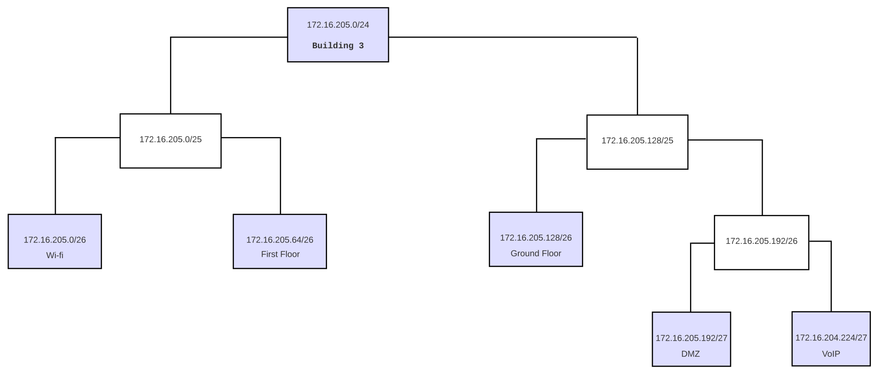
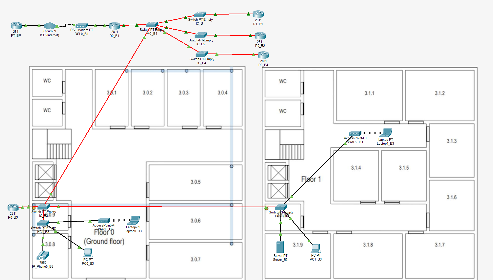
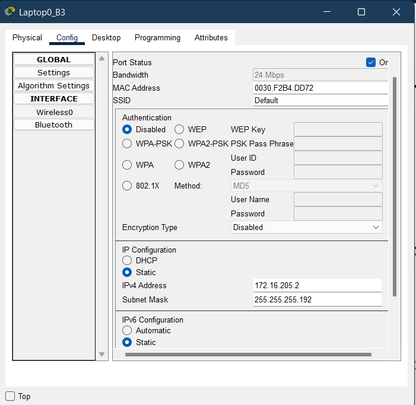
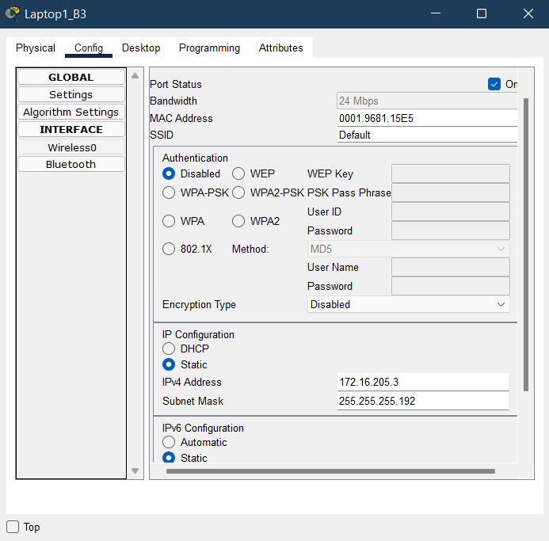

RCOMP 2021-2022 Project - Sprint 2 - Member 1200720 folder
===========================================

# Building 3

### VLAN database and IPv4 network

|              | VLAN ID | VLAN Name     | TOTAL NODES | NETMASK | IP             | FIRST IP       | LAST IP        | BROADCAST      |
|--------------|---------|---------------|-------------|---------|----------------|----------------|----------------|----------------|
| Wi-fi        | 253     | b3wifi        | 55          | /26     | 172.16.205.0   | 172.16.205.1   | 172.16.205.62  | 172.16.205.63  |
| First Floor  | 252     | b3firstfllor  | 45          | /26     | 172.16.205.64  | 172.16.205.65  | 172.16.205.126 | 172.16.205.127 |
| Ground Floor | 251     | b3groundfloor | 35          | /26     | 172.16.205.128 | 172.16.205.129 | 172.16.205.190 | 172.16.205.191 |
| DMZ          | 254     | b3dmz         | 28          | /27     | 172.16.205.192 | 172.16.205.193 | 172.16.205.222 | 172.16.205.223 |
| VoIP         | 255     | b3voip        | 25          | /27     | 172.16.205.224 | 172.16.205.225 | 172.16.205.254 | 172.16.205.255 |

### Packet Tracer

