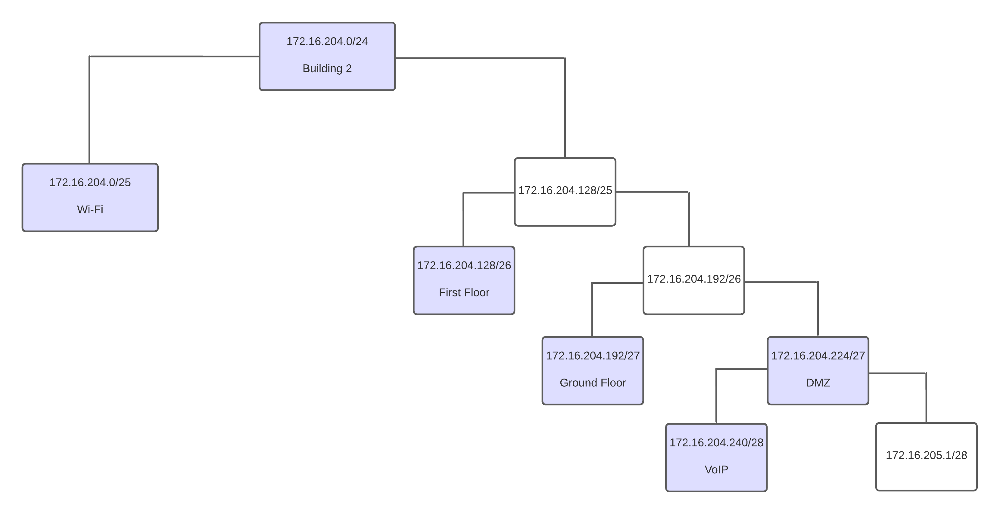

RCOMP 2021-2022 Project - Sprint 2 - Member 1201239 folder
===========================================

# Building 2

### VLAN Database and IPv4 Network

## VLAN Database and IPv4 Network Table ##

|                | VLAN ID | VLAN Name     | TOTAL NODES | IP                | FIRST IP          | LAST IP           | BROADCAST         |
|----------------|---------|---------------|-------------|-------------------|-------------------|-------------------|-------------------|
|Wi-Fi           | 248     | b2wifi        | 120         | 172.16.204.0/25   | 172.16.204.1/25   | 172.16.204.126/25 | 172.16.204.127/25 |
|First Floor     | 247     | b2floorone    | 50          | 172.16.204.128/26 | 172.16.204.129/26 | 172.16.204.190/26 | 172.16.204.191/26 |
|Ground Floor    | 246     | b2groundfloor | 25          | 172.16.204.192/27 | 172.16.204.193/27 | 172.16.204.224/27 | 172.16.204.223/27 |
|DMZ             | 249     | b2dmz         | 12          | 172.16.204.224/28 | 172.16.204.225/28 | 172.16.204.238/28 | 172.16.204.239/28 |
|VoIP            | 250     | b2voip        | 12          | 172.16.204.240/28 | 172.16.204.241/28 | 172.16.204.254/28 | 172.16.204.255/28 |

> According to the presented diagram, there are still 37 nodes which have available unused IP's, allowing for future expansion.

### Routing Tables ##