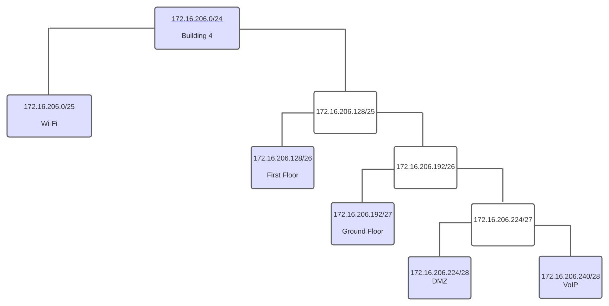

RCOMP 2021-2022 Project - Sprint  - Member 1201382 folder
===========================================

# Edifício 4

### VLAN database and IPv4 network

|                |VLAN ID |VLAN Name      | TOTAL NODES  | IP               | FIRST IP         | LAST IP          |  BROADCAST          |
|----------------|--------|---------------|--------------|------------------|------------------|------------------|---------------------|
|Wi-Fi           |258     | b4wifi        |70            |172.16.206.0/25   |172.16.206.1/25   |172.16.206.126/25 |172.16.206.127/25    |
|First Floor     |257     | b4floorone    |55            |172.16.206.128/26 |172.16.206.129/26 |172.16.206.190/26 |172.16.206.191/26    |
|Ground Floor    |256     | b4groundfloor |28            |172.16.206.192/27 |172.16.206.193/27 |172.16.206.222/27 |172.16.206.223/27    |
|DMZ             |259     | b4dmz         |10            |172.16.206.224/28 |172.16.206.225/28 |172.16.206.238/28 |172.16.206.239/28    |
|VoIP            |260     | b4voip        |12            |172.16.206.240/28 |172.16.206.241/28 |172.16.206.254/28 |172.16.206.255/28    |

