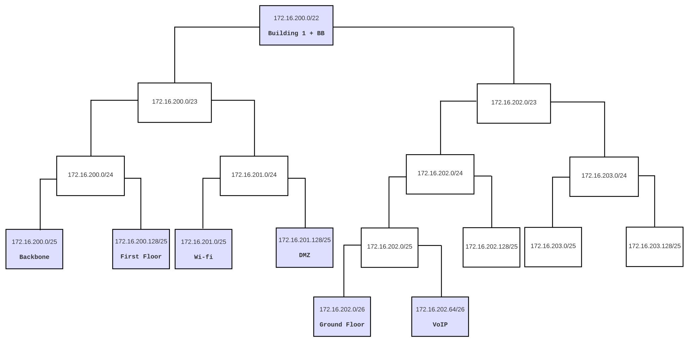

RCOMP 2021-2022 Project - Sprint  - Member 1201386 folder
===========================================

# Edifício 1

### VLAN database and IPv4 network

|                |VLAN ID |VLAN Name      | TOTAL NODES  | IP               | FIRST IP         | LAST IP          |  BROADCAST          |
|----------------|--------|---------------|--------------|------------------|------------------|------------------|---------------------|
|Backbone        |240     | backbone      |120           |172.16.200.0/25   |172.16.200.1/25   |172.16.200.126/25 |172.16.200.127/25    |
|Floor One       |242     | b1floorone    |80            |172.16.200.128/25 |172.16.200.129/25 |172.16.200.254/25 |172.16.200.255/25    |
|Wi-Fi           |243     | b1wifi        |120           |172.16.201.0/25   |172.16.201.1/25   |172.16.201.126/25 |172.16.201.127/25    |
|DMZ             |244     | b1dmz         |100           |172.16.201.128/25 |172.16.201.129/25 |172.16.201.254/25 |172.16.201.255/25    |
|Ground floor    |241     | b1groundfloor |60            |172.16.202.0/26   |172.16.202.1/26   |172.16.202.62/26  |172.16.202.63/26     |
|VoIP            |245     | b1voip        |40            |172.16.202.64/26  |172.16.202.65/26  |172.16.202.126/26 |172.16.202.127/26    |

#### Relevant Justifications
(Ainda não está finalizado)
- This solution allows for future expansion in building 1, if necessary due to the fact that networks 172.16.202.128/25 and 172.16.203.0/24 are empty, which can be divided into more networks as needed.

### Commands and Settings

- VLAN Trucking Protocol (VTP) was successfully configured, VTP domain name assigned was rc22deg1.
