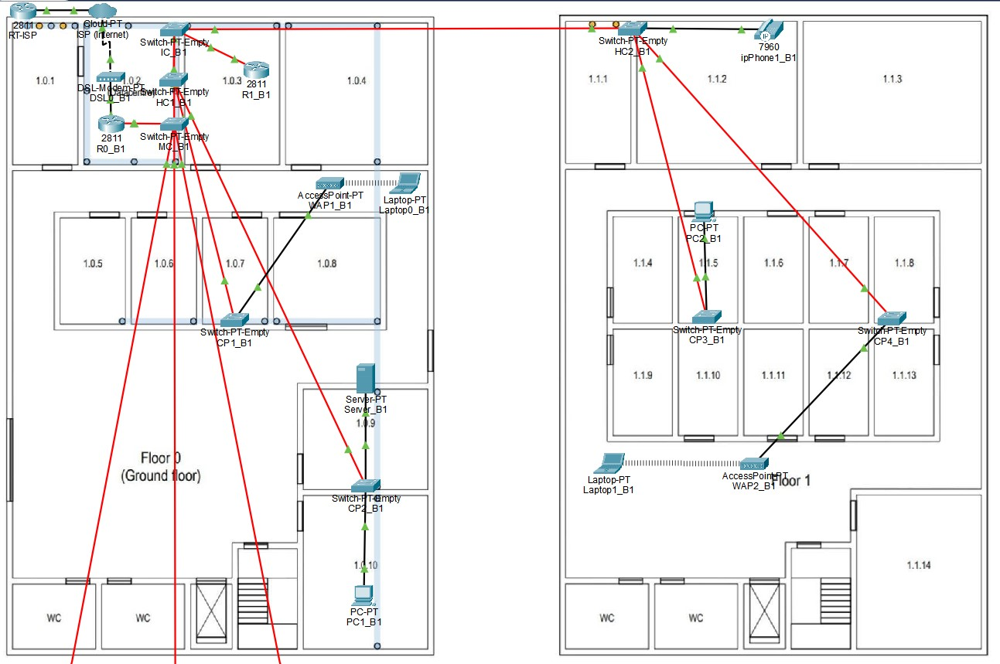

RCOMP 2021-2022 Project - Sprint  - Member 1201386 folder
===========================================

# Edifício 1

### VLAN database and IPv4 network

|                |VLAN ID |VLAN Name      | TOTAL NODES  | IP               | FIRST IP         | LAST IP          |  BROADCAST          |
|----------------|--------|---------------|--------------|------------------|------------------|------------------|---------------------|
|Backbone        |240     | backbone      |120           |172.16.200.0/25   |172.16.200.1/25   |172.16.200.126/25 |172.16.200.127/25    |
|First Floor     |242     | b1floorone    |80            |172.16.200.128/25 |172.16.200.129/25 |172.16.200.254/25 |172.16.200.255/25    |
|Wi-Fi           |243     | b1wifi        |120           |172.16.201.0/25   |172.16.201.1/25   |172.16.201.126/25 |172.16.201.127/25    |
|DMZ             |244     | b1dmz         |100           |172.16.201.128/25 |172.16.201.129/25 |172.16.201.254/25 |172.16.201.255/25    |
|Ground Floor    |241     | b1groundfloor |60            |172.16.202.0/26   |172.16.202.1/26   |172.16.202.62/26  |172.16.202.63/26     |
|VoIP            |245     | b1voip        |40            |172.16.202.64/26  |172.16.202.65/26  |172.16.202.126/26 |172.16.202.127/26    |

#### Relevant Justifications
- This solution allows for future expansion in building 1, if necessary due to the fact that networks 172.16.202.128/25 and 172.16.203.0/24 are empty, which can be divided into more networks as needed.

### Packet Tracer

#### Backbone
- O *backbone* do campus está epresentado na simulação através do ***Switch MC*** (que corresponde ao ***Main-cross connect do campus***), pelos vários ***Switches IC*** de todos os edifícios e pelo **router 0 do edifício 1.

#### Internet

- A representar a ligação à Internet está uma ***Cloud***, um **router ISP** (de endereço 15.203.47.93/30) e um ***Modem***, respeitando a configuração apresentada na PL3. O router RT-ISP está a finalizar a ligação da Internet, tendo sido o ponto de contacto escolhido entre a Internet proveniente dos elementos anteriormente apresentados e a *network* interior.

#### Especificações

A implementação dos requistios propostos para o edifício 1 começa a partir do *Switch* de *hostname* **ICC-B1** que estabelece uma ligação a dois outros *switches* representantes dos pisos 0 e 1 (**HCC-B1-F0** e **HCC-B1-F1** respetivamente). Todos os *switches* foram configurados de forma a possuírem a quantidade de portas necessárias para estabelecer as ligações especificadas no enunciado (portas **FGE** para os cabos de fibra e portas **FCE** para cabos de cobre).
Todas as portas que **não se encontram ligadas a *end-devices* **, encontram-se configuradas em ***trunk mode*** (caso do *switch* ICC-B1), sendo o tipo de porta indicado para estabelecer uma ligação a várias VLANs. Por outro lado, as portas que se conectam com *end-devices* estão configuradas em ***access mode***, uma vez que apenas estabelecem ligação a uma única VLAN.
Nas configurações dos dois **HCC's** do edifício, foram associadas as VLANs (correspondentes aos *end-devices* do edifício) com ids pertencentes a [120-124]:

   1. **VLAN 241: B1-F0**, representada pelo dispositivo ;
   2. **VLAN 242: B1-F1**, representada pelo dispositivo ;
   3. **VLAN 243: B1-WIFI**, representada pelos dispositivos , cada um com um **LAPTOP** a si conectado ;
   4. **VLAN 244: B1-VOIP**, representada pelo dispositivo ;
   5. **VLAN 245: B1-DMZ**, representada pelo dispositivo .

### Routing Tables 

#### Building 1 MC - R0_B1 (172.16.200.6/25) ###

| Network               | Next Hop                  |
|-----------------------|---------------------------|
| 172.16.201.0/24 		|		172.16.200.1		|
| 172.16.204.0/24		|		172.16.200.2		|
| 172.16.205.0/24 		|		172.16.200.3		|
| 172.16.206.0/24		|	    172.16.200.4	  	|
| 172.16.200.128/25 	|		172.16.200.1		|
| 172.16.202.0/25		|		172.16.200.1		|
| 0.0.0.0/0 			|		15.203.47.93    	|

#### Building 1 - R1_B1 (172.16.200.1/25) ###

| Network               | Next Hop                  |
|-----------------------|---------------------------|
| 0.0.0.0/0 			|		172.16.200.6		|

#### Building 2 - R0_B2 (172.16.200.2/25) ###

| Network               | Next Hop                  |
|-----------------------|---------------------------|
| 0.0.0.0/0 			|		172.16.200.6		|

#### Building 3 - R0_B3 (172.16.200.3/25) ###

| Network               | Next Hop                  |
|-----------------------|---------------------------|
| 0.0.0.0/0 			|		172.16.200.6		|

#### Building 4 - R0_B4 (172.16.200.4/25) ###

| Network               | Next Hop                  |
|-----------------------|---------------------------|
| 0.0.0.0/0 			|		172.16.200.6		|

#### ISP - RT-ISP (15.203.47.93/30) ###

| Network               | Next Hop                  |
|-----------------------|---------------------------|
| 172.16.200.0/21 	    |		15.203.47.94		|

